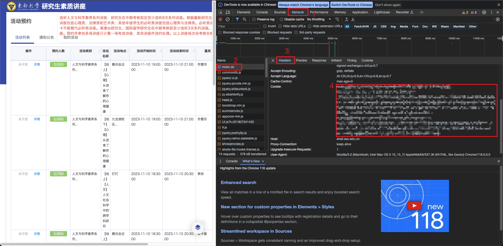

# 东南大学 人文与科学素养系列 抢课

**许可证：MIT License**

位置：信息门户——>学术交流与文体活动

项目主要依赖：
- 网络请求：requests
- 验证码识别：ddddocr
- 图像处理：Pillow
- 加密解密：pycryptodome
- 终端美化：rich

项目使用uv作为虚拟环境和包管理工具，配置了清华镜像源以加速依赖安装。

感谢：[@Golevka2001](https://github.com/Golevka2001) [@surgery7630](https://github.com/surgery7630) [@DgntYang](https://github.com/DgntYang) [@GeeeekExplorer](https://github.com/GeeeekExplorer)

## 安装依赖与虚拟环境配置

### 环境要求
**Python >= 3.11**（项目pyproject.toml中指定的最低版本）

### 使用uv管理环境与依赖
本项目使用uv作为包管理工具，它比传统的pip更快、更高效。

#### 安装uv（如果尚未安装）
```bash
python -m pip install uv
```

#### 初始化虚拟环境
```bash
uv venv
```

#### 激活虚拟环境
- Windows:
```bash
.venv\Scripts\activate
```
- macOS/Linux:
```bash
source .venv/bin/activate
```

#### 安装项目依赖
项目已配置清华镜像源（在pyproject.toml中），可以加速安装过程：
```bash
uv pip install -e .
# 或者直接从pyproject.toml安装
uv pip install .
```

### 依赖说明
本项目依赖的主要包及其用途：
- **ddddocr (>=1.5.6)**：验证码识别库，用于自动识别讲座预约系统的验证码
- **pillow (>=11.3.0)**：图像处理库，用于处理验证码图片
- **pycryptodome (>=3.23.0)**：加密解密库，用于处理登录认证过程中的密码加密
- **requests (>=2.32.5)**：HTTP请求库，用于与讲座预约系统进行通信
- **rich (>=14.1.0)**：终端美化库，提供彩色输出、进度条等功能，提升用户体验

### 手动安装依赖（可选）
如果需要手动安装依赖，可以使用以下命令：
```bash
pip install ddddocr>=1.5.6 pillow>=11.3.0 pycryptodome>=3.23.0 requests>=2.32.5 rich>=14.1.0 -i https://pypi.tuna.tsinghua.edu.cn/simple
```

## 更新日志

### 2025/10/09 更新

1. **多因素认证支持**: 实现手机验证码功能，支持非可信设备登录验证
   - 新增 `get_mobile_verify_code()` 函数，用于发送手机验证码
   - 优化登录流程，当检测到非可信设备时自动引导用户输入手机验证码

2. **配置优化**: 在配置文件中增加指纹存储，下次启动时自动使用已保存的指纹

3. **项目结构优化**: 更新了项目依赖管理，使用uv作为虚拟环境和包管理工具

### 2025/04/16 更新

更新界面，优化抢课逻辑

### 2025/04/08 更新

尝试通过降低ssl安全级别以解决校园网内报错`unsafe legacy renegotiation disabled`

### 2024/10/29 更新

验证码、预约功能已恢复，但是发现验证码识别正确率偏低，以及经常触发“请勿多设备登录……” [@Golevka2001](https://github.com/Golevka2001)


### 2023/11/13 更新

1. 修复 [Issue #8](https://github.com/zhjcreator/fetch_lecture/issues/8) 反馈的问题，错误原因为：身份认证后忘记更新 Headers，Content-Type 没有从 `application/json` 改为 `application/x-www-form-urlencoded`。目前本地测试通过，如仍存在问题请继续反馈。

### 2023/11/12 更新

1. 修复 ddddocr 与 pillow 版本的问题，且限制 python 版本在 3.9 及以下
2. TODO：[Issue #8](https://github.com/zhjcreator/fetch_lecture/issues/8) 反馈的问题，需等待下一轮预约开放后测试

### 2023/11/7 更新

1. 修复身份验证问题（没有手动获取 cookie 的必要）

2. 更新依赖

3. 剔除旧版/无用代码

### 2023/11/6 更新

1. seu_auth.py, login_to_ehall.py 改自 https://github.com/Golevka2001/SEU-Auth.git

2. 由于登录讲座页面时无法自动获取 cookie，此处采用手动获取 cookie 的方式

   2.1 进入 http://ehall.seu.edu.cn/gsapp/sys/jzxxtjapp/*default/index.do#/hdyy 网站

   2.2 按 F12，刷新页面，按如图顺序找到该页面对应 cookie

   

   2.3 将 cookie 贴入 main.py，赋值给 main(lecture_cookie)的参数 lecture_cookie

   ```python
   if __name__ == '__main__':
       lecture_cookie = '[你的cookie]'
       main(lecture_cookie)
   ```

3. 添加了捡漏功能

### 2022/4/20 更新

使用 ddddocr 识别验证码，玄学验证，大概 80%成功率。等数据集收集完成可能更新为私有模型。
